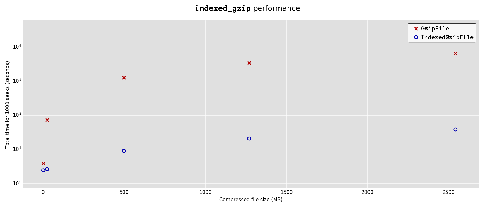

# indexed_gzip


[](https://travis-ci.org/pauldmccarthy/indexed_gzip)


 *Fast random access of gzip files in Python*


 * [Overview](#overview)
 * [Installation](#installation)
 * [Usage](#usage)
 * [Performance](#performance)
 * [Acknowledgements](#acknowledgements)
 * [License](#license)


## Overview


The `indexed_gzip` project is a Python extension which aims to provide a
drop-in replacement for the built-in Python `gzip.GzipFile` class, the
`IndexedGzipFile`.


`indexed_gzip` was written to allow fast random access of compressed
[NIFTI](http://nifti.nimh.nih.gov/) image files (for which GZIP is the
de-facto compression standard), but will work with any GZIP file.
`indexed_gzip` is easy to use with `nibabel` (http://nipy.org/nibabel/).


The standard `gzip.GzipFile` class exposes a random access-like interface (via
its `seek` and `read` methods), but every time you seek to a new point in the
uncompressed data stream, the `GzipFile` instance has to start decompressing
from the beginning of the file, until it reaches the requested location.


An `IndexedGzipFile` instance gets around this performance limitation by
building an index, which contains *seek points*, mappings between
corresponding locations in the compressed and uncompressed data streams. Each
seek point is accompanied by a chunk (32KB) of uncompressed data which is used
to initialise the decompression algorithm, allowing us to start reading from
any seek point. If the index is built with a seek point spacing of 1MB, we
only have to decompress (on average) 512KB of data to read from any location
in the file.


## Installation


`indexed_gzip` is available on [PyPi](https://pypi.python.org/pypi) - to
install, simply type:
```sh
pip install indexed_gzip
```

To compile `indexed_gzip`, make sure you have [cython](http://cython.org/)
installed, and then run:
```sh
python setup.py build_ext --inplace
```


To run the tests, type the following; you will need `numpy` and `pytest`
installed:
```sh
python setup.py test
```

## Usage


You can use the `indexed_gzip` module directly:


```python
import indexed_gzip as igzip

# You can create an IndexedGzipFile instance
# by specifying a file name, or an open file
# handle. For the latter use, the file handle
# must be opened in read-only binary mode.
# Write support is currently non-existent.
myfile = igzip.IndexedGzipFile(filename='big_file.gz')

some_offset_into_uncompressed_data = 234195

# The index will be automatically
# built on-demand when seeking or
# reading.
myfile.seek(some_offset_into_uncompressed_data)
data = myfile.read(1048576)
```


Or you can use `indexed_gzip` with `nibabel`:


```python
import nibabel      as nib
import indexed_gzip as igzip

# Here we are usin 4MB spacing between
# seek points, and using a larger read
# buffer (than the default size of 16KB).
fobj = igzip.IndexedGzipFile(
    filename='big_image.nii.gz',
    spacing=4194304,
    readbuf_size=131072)

# Create a nibabel image using
# the existing file handle.
fmap = nib.Nifti1Image.make_file_map()
fmap['image'].fileobj = fobj
image = nib.Nifti1Image.from_file_map(fmap)

# Use the image ArrayProxy to access the
# data - the index will automatically be
# built as data is accessed.
vol3 = image.dataobj[:, :, :, 3]
```


`indexed_gzip` does not currently have any support for writing. Currently if you
wish to write to a file, you will need to save the file by alternate means (e.g.
via `gzip` or `nibabel`), and then re-create a new `IndexedGzipFile` instance.
Building on the `nibabel` example above:


```python

# Load the entire image into memory
data = image.get_data()

# Make changes to the data
data[:, :, :, 5] *= 100

# Save the image using nibabel
nib.save(data, 'big_image.nii.gz')

# Re-create an IndexedGzipFile and
# Nifti1Image instance as above
fobj = igzip.IndexedGzipFile(...)
fmap = nib.Nifti1Image.make_file_map()
fmap['image'].fileobj = fobj
image = nib.Nifti1Image.from_file_map(fmap)
```


## Performance


A small [test script](benchmark_indexed_gzip.py) is included with `indexed_gzip`;
this script compares the performance of the `IndexedGzipFile` class with the
`gzip.GzipFile` class. This script does the following:


  1. Generates a specified number of seek locations, uniformly spaced
     throughout the input file.

  2. Randomly shuffles these locations

  3. Seeks to each location, and reads a chunk of data from the file.


This plot shows the results of this test for a few compresed files of varying
sizes, with 1000 seeks:





## Acknowledgements


The `indexed_gzip` project is based upon the `zran.c` example (written by Mark
Alder) which ships with the [zlib](http://www.zlib.net/) source code.


`indexed_gzip` was originally inspired by Zalan Rajna's (@zrajna)
[zindex](https://github.com/zrajna/zindex) project:

    Z. Rajna, A. Keskinarkaus, V. Kiviniemi and T. Seppanen
    "Speeding up the file access of large compressed NIfTI neuroimaging data"
    Engineering in Medicine and Biology Society (EMBC), 2015 37th Annual
    International Conference of the IEEE, Milan, 2015, pp. 654-657.

    https://sourceforge.net/projects/libznzwithzindex/


Initial work on `indexed_gzip` took place at
[Brainhack](http://www.brainhack.org/) Paris, at the Institut Pasteur,
24th-26th February 2016, with the support of the
[FMRIB Centre](https://www.ndcn.ox.ac.uk/divisions/fmrib/), at the
University of Oxford, UK.


Many thanks to:

 - Martin Craig (@mcraig-ibme): porting `indexed_gzip` to Windows (#3)
 - Zalan Rajna (@zrajna): bug fixes (#2)
 - Chris Markiewicz (@effigies): Option to drop file handles (#6)


## License


`indexed_gzip` inherits the [zlib](http://www.zlib.net) license, available for
perusal in the [LICENSE](LICENSE) file.
